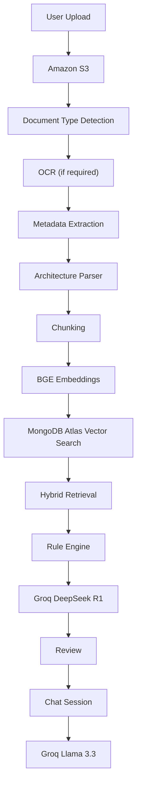

# AI Architecture Review Assistant — Implementation Plan

## Overview

A production-grade SaaS platform that accepts architecture documents, automatically generates AI-powered architecture reviews with scoring, risk identification, and recommendations, and supports conversational follow-up analysis via RAG. It supports a wide array of document formats including SRS, HLD, LLD, API Specs, Open API/Swagger, Architecture Diagrams, and scanned PDFs.

---

## User Review Required

> [!IMPORTANT]
> **Gemini Credentials**: You must have an active Google Gemini API Key for Gemini 2.5 Flash (used for OCR, Metadata, and Architecture Review).
> **Groq Credentials**: You must have an active Groq API Key to access Llama 3.3 (used for low-latency Chat).
> **AWS Credentials**: You must have an active AWS account for Amazon S3 storage in your chosen region (default: `us-east-1`).
> **MongoDB Atlas**: You need a MongoDB Atlas cluster (M10+ recommended for Vector Search). Free tier (M0) supports limited Vector Search.

## Resolved Decisions

| Decision | Resolution |
|---|---|
| **Authentication** | Google OAuth + Email/Password + Forgot Password + Remember Me |
| **Upload Strategy** | Multer + multer-s3 (server-proxied) |
| **Knowledge Base** | 150–300 curated entries across 9 categories (pre-seeded) |
| **TailwindCSS** | v4 (latest) with shadcn/ui |
| **Rate Limiting** | Per-user for AI endpoints, global for general APIs |

---

## Project Structure

```text
Ai Architecture Review Assistant/
├── backend/
│   ├── src/
│   │   ├── config/           # DB, S3, Groq, env config
│   │   ├── middleware/        # auth, error, rateLimiter, upload
│   │   ├── models/           # Mongoose schemas (8 models)
│   │   ├── routes/           # Express route definitions
│   │   ├── controllers/      # Request handlers
│   │   ├── services/         # Business logic layer
│   │   │   ├── documentProcessor.js
│   │   │   ├── chunkingService.js
│   │   │   ├── embeddingService.js
│   │   │   ├── vectorSearchService.js
│   │   │   ├── ragService.js
│   │   │   ├── reviewEngine.js
│   │   │   ├── scoringEngine.js
│   │   │   ├── chatEngine.js
│   │   │   ├── metadataExtractor.js
│   │   │   ├── architectureParser.js
│   │   │   ├── ruleEngine.js
│   │   │   ├── diagramProcessor.js
│   │   │   ├── ocrService.js
│   │   │   └── groq/
│   │   │       ├── groqClient.js
│   │   │       ├── reviewService.js
│   │   │       ├── chatService.js
│   │   │       └── extractionService.js
│   │   ├── utils/            # helpers, logger, validators
│   │   └── prompts/          # AI prompt templates
│   ├── seed/                 # Knowledge base seed data
│   ├── server.js
│   ├── package.json
│   └── .env.example
├── frontend/
│   ├── src/
│   │   ├── components/
│   │   │   ├── ui/           # shadcn/ui components
│   │   │   ├── layout/       # Sidebar, Header, MainLayout
│   │   │   ├── chat/         # ChatWindow, MessageBubble, ChatInput
│   │   │   ├── review/       # ScoreCard, IssueCard, ExecutiveSummary
│   │   │   ├── upload/       # FileUploader, UploadProgress
│   │   │   └── common/       # SuggestionCards, Avatar, SearchBar
│   │   ├── pages/            # LoginPage, ChatPage, SettingsPage
│   │   ├── hooks/            # useAuth, useChat, useProjects
│   │   ├── services/         # API client (axios)
│   │   ├── context/          # AuthContext, ProjectContext
│   │   ├── lib/              # shadcn utils
│   │   └── App.jsx
│   ├── index.html
│   ├── vite.config.js
│   ├── tailwind.config.js
│   ├── components.json
│   └── package.json
├── .gitignore
└── README.md
```

---

## Proposed Changes

### Phase 1: Project Scaffolding & Configuration

#### Backend Setup

##### [NEW] backend/package.json
Dependencies: `express`, `mongoose`, `dotenv`, `cors`, `helmet`, `morgan`, `express-rate-limit`, `jsonwebtoken`, `bcryptjs`, `multer`, `multer-s3`, `@aws-sdk/client-s3`, `@aws-sdk/s3-request-presigner`, `pdf-parse`, `officeparser`, `js-yaml`, `uuid`, `express-validator`, `groq-sdk`, `paddleocr`, `sharp`

##### [NEW] backend/.env.example
```env
GEMINI_API_KEY=
GROQ_API_KEY=
AWS_ACCESS_KEY=
AWS_SECRET_KEY=
AWS_REGION=
S3_BUCKET=
JWT_SECRET=
MONGODB_URI=
GOOGLE_CLIENT_ID=
GOOGLE_CLIENT_SECRET=
```

##### [NEW] backend/src/config/database.js
MongoDB Atlas connection with retry logic

##### [NEW] backend/src/config/aws.js
S3Client initialization

##### [NEW] backend/src/config/env.js
Centralized env variable validation

##### [NEW] backend/server.js
Express app bootstrap with middleware chain: `cors → helmet → morgan → rateLimiter → routes → errorHandler`

#### Frontend Setup

##### [NEW] frontend/ (via Vite)
Initialize with `npx create-vite@latest ./ --template react` then add TailwindCSS v4, shadcn/ui, React Router, Axios

---

### Phase 2: Backend Core — Models, Auth, Projects

#### MongoDB Schemas (8 Models)

##### [NEW] backend/src/models/User.js
```js
{
  name, email, passwordHash, avatar, role,
  settings: { defaultRegion, notifications },
  createdAt, updatedAt
}
```

##### [NEW] backend/src/models/Project.js
```js
{
  userId (ref), name, description, status,
  documentCount, lastReviewAt,
  createdAt, updatedAt
}
```

##### [NEW] backend/src/models/Document.js
```js
{
  projectId (ref), userId (ref),
  fileName, fileType, fileSize, s3Key, s3Url,
  status: ['uploaded','processing','processed','failed'],
  extractedText, metadata,
  architectureData,
  createdAt
}
```

##### [NEW] backend/src/models/DocumentChunk.js
```js
{
  projectId (ref), documentId (ref),
  type: { type: String, enum: ["document","knowledge"] },
  category: String,
  chunkIndex, content, tokenCount,
  embedding: [Number],  // 1024-dim vector using BAAI BGE Large v1.5
  metadata: { source, section, page }
}
// Vector Search Index on 'embedding' field
```

##### [NEW] backend/src/models/Review.js
```js
{
  projectId (ref), userId (ref),
  scores: { totalArchitectureScore, security, scalability, performance, cost, maintainability },
  executiveSummary,
  keyInsights: {
    critical: [{ issue, explanation, recommendation, category }], // e.g., missing rate limit
    high: [{ issue, explanation, recommendation, category }],
    low: [{ issue, explanation, recommendation, category }]
  },
  recommendations: [String],
  pdfReportUrl: String, // URL to the downloadable PDF report
  status, generatedBy: "gemini-2.5-flash", generatedAt
}
```

##### [NEW] backend/src/models/ChatSession.js
```js
{
  projectId (ref), userId (ref), reviewId (ref),
  title, status, createdAt, updatedAt
}
```

##### [NEW] backend/src/models/ChatMessage.js
```js
{
  sessionId (ref), role: ['user','assistant','system'],
  content, modelUsed, citations,
  metadata: { tokensUsed, sources },
  createdAt
}
// Example: modelUsed: "groq-llama-3.3-70b"
```

##### [NEW] backend/src/models/Setting.js
```js
{
  userId (ref), theme, reviewDepth, scoringMode,
  notifications, defaultModel
}
```

#### Authentication Module

##### [NEW] backend/src/routes/authRoutes.js
- `POST /api/auth/register` — Register with email/password
- `POST /api/auth/login` — Login, return JWT + refresh token (remember me = longer expiry)
- `POST /api/auth/forgot-password` — Send password reset email (token-based)
- `POST /api/auth/reset-password` — Reset password with token
- `GET /api/auth/me` — Get current user
- `POST /api/auth/refresh` — Refresh token
- `GET /api/auth/google` — Initiate Google OAuth flow
- `GET /api/auth/google/callback` — Google OAuth callback

##### [NEW] backend/src/controllers/authController.js
##### [NEW] backend/src/services/authService.js
Handles password hashing, JWT generation (short-lived access + refresh token), Google OAuth token exchange, password reset token generation/validation

##### [NEW] backend/src/middleware/authMiddleware.js
JWT verification middleware using `jsonwebtoken`

##### [NEW] backend/src/config/passport.js
Google OAuth2 strategy using `passport` + `passport-google-oauth20`

**Additional dependencies**: `passport`, `passport-google-oauth20`, `nodemailer` (for password reset emails)

#### Project Management Module

##### [NEW] backend/src/routes/projectRoutes.js
- `POST /api/projects` — Create project
- `GET /api/projects` — List user's projects
- `GET /api/projects/:id` — Get project details
- `PUT /api/projects/:id` — Update project
- `DELETE /api/projects/:id` — Delete project + cascade

##### [NEW] backend/src/controllers/projectController.js
##### [NEW] backend/src/services/projectService.js

---

### Phase 3: Document Pipeline & AI Engine

#### Document Upload & Processing

##### [NEW] backend/src/middleware/uploadMiddleware.js
Multer + multer-s3 config for S3 direct upload. Accept: PDF, DOCX, TXT, JSON, YAML, OpenAPI, Swagger, PNG, JPEG, Visio, Draw.io. Max 25MB per file.

##### [NEW] backend/src/routes/documentRoutes.js
- `POST /api/projects/:projectId/documents` — Upload documents (multipart)
- `GET /api/projects/:projectId/documents` — List documents
- `DELETE /api/documents/:id` — Delete document

##### [NEW] backend/src/services/documentProcessor.js
Text extraction pipeline:
- **PDF (Searchable)**: `pdf-parse` library
- **DOCX**: `officeparser` library
- **TXT/JSON/YAML/OpenAPI/Swagger**: Direct read / `js-yaml` parse
- Post-extraction: clean text, normalize whitespace

#### OCR & Diagram Support

##### [NEW] backend/src/services/ocrService.js
Uses `paddleocr` and `sharp` to process visual architectures.
- Only run OCR on: PNG, JPEG, Scanned PDFs, Diagram Images, Visio exports, Draw.io image exports.
- DO NOT run OCR on: DOCX, TXT, JSON, YAML, OpenAPI, Swagger, SQL, Normal searchable PDFs.

##### [NEW] backend/src/services/diagramProcessor.js
After OCR, extracts structural components from diagram text.
- Extracts: Components, Services, Databases, Caches, Queues, External Systems, Cloud Services, Connections, Protocols, Authentication, Network Components.
- Returns structured JSON representation of the diagram.

#### Extraction & Parsing Services

##### [NEW] backend/src/services/metadataExtractor.js
Extracts vital metadata separately from the raw text.
- Cloud Provider, Architecture Style, Programming Language, Database, Messaging, Authentication, Cache, Deployment Model, Framework.
- Stores metadata separately in Document model.

##### [NEW] backend/src/services/architectureParser.js
Parses the architecture details into structured representations.
- Extracts: Microservices, Layers, Dependencies, Relationships, Architecture Patterns, Technology Stack.
- Saves structured output in the database.

#### Rule Engine

##### [NEW] backend/src/services/ruleEngine.js
Implements deterministic checks before LLM analysis.
- Examples: Missing Authentication (Critical), Public Database (Critical), No Cache (Medium), Single Point of Failure (High), No Monitoring (Medium), No Backup Strategy (High).
- The LLM will explain these rule results, but the LLM should NOT invent deterministic findings.

#### Chunking

##### [NEW] backend/src/services/chunkingService.js
Intelligent chunking strategy:
- **Chunk size**: ~800 tokens with 200-token overlap
- **Section-aware**: Split on markdown headers, numbered sections
- **Metadata preservation**: Track source document, section, page number

#### Embedding Pipeline

##### [NEW] backend/src/services/embeddingService.js
- Coordinates batch processing with rate limiting.
- Uses BAAI BGE Large v1.5 or Nomic Embed Text to generate high-quality vector embeddings. DO NOT use OpenAI embeddings.
- Store embeddings in `DocumentChunk.embedding` (e.g. 1024-dim vector using BGE Large v1.5)

##### [NEW] backend/src/services/vectorSearchService.js
- MongoDB Atlas `$vectorSearch` aggregation
- Index: `vector_index` on `DocumentChunk` collection
- Simplifies RAG by querying a single collection with a filter: `{ $or: [{type: "document"}, {type: "knowledge"}] }`
- Similarity: cosine, numCandidates: 150, limit: 10

#### AI Services (Gemini & Groq Stack)

##### [NEW] backend/src/services/aiClient.js
Central initialization for both Google Gemini SDK and Groq SDK.

##### [NEW] backend/src/services/reviewService.js
Dedicated service for Architecture Review, OCR, and Metadata extraction using Gemini 2.5 Flash.
- `generateArchitectureReview()`
- `extractMetadata()`
- `processOCR()`

##### [NEW] backend/src/services/chatService.js
Dedicated service for Chat interactions using Groq Llama 3.3 to orchestrate fast, conversational queries.
- `chatResponse()`

##### [NEW] backend/src/services/ragService.js
RAG retrieval logic used by both Review Engine and Chat Engine:
1. Generate query embedding (BGE Large v1.5)
2. Hybrid Retrieval (MongoDB Vector Search with `$or` filter + metadata filters)
3. Rank and deduplicate results
4. Construct context window
5. Return enriched context to the caller engine

##### [NEW] backend/src/prompts/reviewPrompt.js
System prompt template for DeepSeek R1 architecture review generation. Instructs the model to output structured JSON with scores, findings, risks, recommendations, and explanations for rule engine findings.

##### [NEW] backend/src/prompts/chatPrompt.js
System prompt for conversational analysis using Llama 3.3 70B. Includes review context, document context, and conversation history.

##### [NEW] backend/src/prompts/scoringPrompt.js
Deterministic scoring rules for LLM evaluation.

#### Architecture Review Engine

##### [NEW] backend/src/services/reviewEngine.js
Orchestrates the full automated review pipeline:
1. Requirement Analysis
2. Architecture Analysis
3. Security Analysis
4. Scalability Analysis
5. Performance Analysis
6. Reliability Analysis
7. Maintainability Analysis
8. Cost Analysis
9. Rule Engine (Execute deterministic checks)
10. Groq DeepSeek R1 (Generate holistic review & explain deterministic findings)
11. Final Report (Combine and format findings)

##### [NEW] backend/src/services/scoringEngine.js
- Parse findings from review and rule engine results
- Apply deduction rules per severity
- Calculate per-category and overall scores
- Attach reasoning to each score

##### [NEW] backend/src/routes/reviewRoutes.js
- `POST /api/projects/:projectId/reviews/generate` — Trigger review
- `GET /api/projects/:projectId/reviews` — List reviews
- `GET /api/reviews/:id` — Get review detail

#### Conversational AI Module

##### [NEW] backend/src/routes/chatRoutes.js
- `POST /api/chat/sessions` — Create session
- `GET /api/chat/sessions` — List sessions
- `GET /api/chat/sessions/:id` — Get session with messages
- `POST /api/chat/sessions/:id/messages` — Send message (RAG response)
- `DELETE /api/chat/sessions/:id` — Delete session

##### [NEW] backend/src/controllers/chatController.js
- Routes incoming chat requests to `chatEngine.js`

##### [NEW] backend/src/services/chatEngine.js
- Dedicated chat orchestrator
- Focuses on user questions, follow-up analysis, cost optimization, security discussion, and architecture improvements.
- Uses `chatService.js` (Groq Llama 3.3 70B) for lightning-fast responses.
- Flow: User Question → Generate Query Embedding (BGE) → Hybrid Retrieval (MongoDB) → Context Builder → Groq Chat → Response

#### Knowledge Base Module

##### [NEW] backend/src/routes/knowledgeBaseRoutes.js
- `POST /api/knowledge-base/seed` — Seed KB from JSON files into `DocumentChunk` with `type: "knowledge"`

##### [NEW] backend/seed/ (150–300 curated entries across 9 JSON files)

| File | Category | Entries | Topics |
|---|---|---|---|
| `cloudArchitecture.json` | Cloud Architecture | 20–30 | AWS Well-Architected Pillars, HA, DR, Scalability, Load Balancing, Caching, Multi-Region |
| `security.json` | Security | 20–30 | OWASP Top 10, API Security Top 10, AuthN, AuthZ, Encryption, Secrets Mgmt, Zero Trust |
| `softwareArchitecture.json` | Software Architecture | 20–40 | SOLID, Clean Architecture, Hexagonal, Layered, Modular Monolith, Event-Driven |
| `distributedSystems.json` | Distributed Systems | 30–40 | Saga, CQRS, Event Sourcing, Circuit Breaker, Retry, Bulkhead, API Gateway, Service Discovery |
| `apiDesign.json` | API Design | 15–25 | REST, OpenAPI, Versioning, Pagination, Rate Limiting, Idempotency |
| `databaseDesign.json` | Database Design | 20–30 | Normalization, Indexing, Replication, Sharding, CAP Theorem, Caching |
| `observability.json` | Observability | 15–20 | Metrics, Logging, Tracing, SLI, SLO, Error Budgets |
| `devops.json` | DevOps | 15–20 | Docker, Kubernetes, CI/CD, GitOps, Canary, Blue-Green |
| `adrs.json` | ADRs | 10–20 | PostgreSQL vs MongoDB, Kafka vs RabbitMQ, Monolith vs Microservices, JWT vs Session |

Each entry follows a consistent structure:
```json
{
  "title": "Circuit Breaker Pattern",
  "category": "Distributed Systems",
  "subcategory": "Resilience Patterns",
  "description": "Prevents cascading failures by stopping requests to unhealthy services.",
  "best_practices": ["Use timeout thresholds", "Monitor failure rates"],
  "anti_patterns": ["No fallback strategy"],
  "related_topics": ["Retry Pattern", "Bulkhead Pattern"],
  "review_areas": ["Fault Tolerance", "Resilience"],
  "severity_if_missing": "High"
}
```

---

### Phase 4: Frontend — UI Components & Pages

#### Design System

##### [NEW] frontend/src/index.css
- Light theme with professional color palette
- CSS variables: `--primary: hsl(222, 89%, 55%)` (rich blue), accent gradients
- Typography: Inter font family
- Glassmorphism-lite card styles, smooth shadows

#### Layout Components

##### [NEW] frontend/src/components/layout/Sidebar.jsx
- **Top**: "New Chat" button, search input
- **Middle**: Scrollable list of previous chat sessions (grouped by date)
- **Bottom**: User avatar, name, email, settings gear icon
- Collapsible on mobile, animated slide transitions

##### [NEW] frontend/src/components/layout/MainLayout.jsx
Sidebar + main content area layout

#### Chat Components

##### [NEW] frontend/src/components/chat/ChatWindow.jsx
ChatGPT-style message area with auto-scroll, loading indicators

##### [NEW] frontend/src/components/chat/MessageBubble.jsx
Renders user and assistant messages. Assistant messages support rich markdown rendering.

##### [NEW] frontend/src/components/chat/ChatInput.jsx
Sticky bottom input with attach button (triggers file upload), send button, textarea with auto-resize

##### [NEW] frontend/src/components/chat/SuggestionCards.jsx
Grid of clickable suggestion cards shown before first message or after review

#### Review Components

##### [NEW] frontend/src/components/review/ScoreCard.jsx
Architecture score card with animated circular progress indicators for each category (total architecture score, security, scalability, performance, cost, maintainability). Color-coded: green (75+), yellow (50-74), red (<50).

##### [NEW] frontend/src/components/review/InsightCard.jsx
Key insight card separated by criticality (Critical=red, High=orange, Low=blue). Displays issue title, explanation, and clear recommendations (e.g. Critical: Rate Limiting Missing).

##### [NEW] frontend/src/components/review/ExecutiveSummary.jsx
Formatted summary with expandable sections and high-level architectural overview.

##### [NEW] frontend/src/components/review/ReviewReport.jsx
Composite component that renders the full initial review: ScoreCard → ExecutiveSummary → Key Insights (Critical/High/Low) → Recommendations. Includes a prominent "Download as PDF" button for users to export the report.

#### Upload Components

##### [NEW] frontend/src/components/upload/FileUploader.jsx
Drag-and-drop zone with file type icons, progress bars, multi-file support. Accepted: PDF, DOCX, TXT, JSON, YAML, PNG, JPEG, Visio, Draw.io.

##### [NEW] frontend/src/components/upload/UploadProgress.jsx
Per-file progress with status indicators

#### Pages

##### [NEW] frontend/src/pages/LoginPage.jsx
Clean login/register form with email/password

##### [NEW] frontend/src/pages/ChatPage.jsx
Main application page: Sidebar + ChatWindow. Handles the full flow:
1. New chat → show upload prompt + suggestion cards
2. After upload → show processing indicator → auto-display review
3. Ongoing → conversational Q&A

##### [NEW] frontend/src/pages/SettingsPage.jsx
User preferences: profile, review depth, notification settings

#### Services & State

##### [NEW] frontend/src/services/api.js
Axios instance with JWT interceptor, base URL config

##### [NEW] frontend/src/services/authApi.js, projectApi.js, documentApi.js, chatApi.js, reviewApi.js

##### [NEW] frontend/src/context/AuthContext.jsx
JWT token management, login/logout/register, user state

##### [NEW] frontend/src/context/ProjectContext.jsx
Active project, chat sessions, review data

##### [NEW] frontend/src/hooks/useAuth.js, useChat.js, useProjects.js

---

### Phase 5: Integration & Automated Pipeline

#### [MODIFY] backend/src/controllers/documentController.js
After successful upload, trigger the automated pipeline:
```
Upload → S3 → Document Type Detection → OCR (if required) → Metadata Extraction → Architecture Parsing → Chunking → BGE Embeddings → MongoDB Atlas Vector Search → Review Engine
```
This runs asynchronously. Frontend polls for status via WebSocket or polling endpoint.

#### [NEW] backend/src/services/pipelineOrchestrator.js
Coordinates the full document-to-review pipeline:
1. Update document status to 'processing' (Upload -> S3)
2. Detect Document Type
3. Text Extraction OR OCR via `ocrService.js` and `diagramProcessor.js`
4. Metadata Extraction via `metadataExtractor.js`
5. Architecture Parsing via `architectureParser.js`
6. Chunking via `chunkingService.js`
7. Embedding via BGE Large v1.5 (`embeddingService.js`)
8. Store chunks with embeddings in MongoDB Atlas Vector Search
9. Execute Deterministic Checks via `ruleEngine.js`
10. Trigger review generation via Groq DeepSeek R1 (`reviewEngine.js`)
11. Generate Scores (`scoringEngine.js`)
12. Save Review & Create Chat Session
13. Update document status to 'processed'
14. Emit completion event

---

### Phase 6: Polish & Production Readiness

#### [NEW] backend/src/middleware/errorHandler.js
Global error handler with structured error responses

#### [NEW] backend/src/middleware/rateLimiter.js
Express-rate-limit: 100 req/15min for general, 10 req/min for AI endpoints

#### [NEW] backend/src/utils/logger.js
Winston or pino logger with structured JSON output

#### [NEW] backend/src/utils/validators.js
Express-validator schemas for all routes

---

## Key Architecture Decisions

| Decision | Choice | Rationale |
|---|---|---|
| Upload method | Multer + multer-s3 | Enables immediate server-side processing after upload |
| Embedding model | BAAI BGE Large v1.5 | High-quality open-source text embeddings, fast generation |
| Review & OCR LLM | Gemini 2.5 Flash | Superior multimodal capabilities for OCR, metadata, and deep architecture review |
| Chat LLM | Groq Llama 3.3 | Lightning-fast inference speeds suitable for real-time conversational chat |
| Vector DB | MongoDB Atlas Vector Search | Single database for both app data and vectors (Hybrid Retrieval) |
| Report Export | PDF Generation | Allows users to download the comprehensive review scores and insights |
| Frontend framework | Vite + React | Fast dev experience, modern tooling |
| Styling | TailwindCSS + shadcn/ui | Rapid UI development with professional components |

## RAG Pipeline Architecture



## Verification Plan

### Automated Tests
- Backend: Start server, verify all API routes respond correctly
- Groq API Tests: Validate DeepSeek R1, Llama 3.3, and Qwen 3 structured outputs and latency limits
- Embedding Generation Tests: Ensure BGE Large v1.5 vector shape and normalization
- OCR Tests: Test `paddleocr` against sample PNG/JPEG diagrams and ensure structured extraction
- Diagram Parsing Tests: Verify logic parsing of bounding boxes and extracted text to components
- Rule Engine Tests: Verify deterministic rules (e.g. Missing Auth, No Backup Strategy) fail correctly
- Hybrid Retrieval Tests: Verify semantic + keyword search in MongoDB Atlas Vector Search
- Architecture Review Tests: Validate end-to-end review orchestration with Groq models

### Manual Verification
- Browser testing of full UI flow
- Upload a complex architecture diagram (Visio export / PNG) and verify OCR + rule engine catching DB exposure
- Test chat follow-up questions with RAG context via Groq Llama 3.3 70B
- Verify score card rendering and issue card color coding (separating heuristic from deterministic findings)
- Test responsive layout and sidebar behavior

